 

&nbsp;
&nbsp;

## About

- Backend engineer building APIs and distributed systems in **Node.js / NestJS / TypeScript**
- Domains I ship in: **healthcare, fintech, SaaS** — third-party integrations, payments, async job pipelines, bulk data processing
- What I care about: clear domain boundaries, idempotent jobs, tests that catch real regressions, docs people actually read
- Most of my work lives in private repositories — the activity below is its public footprint

## Stack

 

| | |
|---|---|
| **Backend** | Node.js, NestJS, Express, Fastify, TypeScript |
| **Data** | PostgreSQL, MongoDB, Redis, TypeORM, Prisma, Mongoose |
| **Async & real-time** | BullMQ, Redis, WebSocket |
| **Integrations** | Stripe, SendGrid, REST, GraphQL, OAuth2 |
| **Cloud & DevOps** | Docker, AWS S3, Firebase, Supabase, GitHub Actions, Azure DevOps |
| **Quality** | Jest, Sentry, Swagger / OpenAPI |

## Activity

